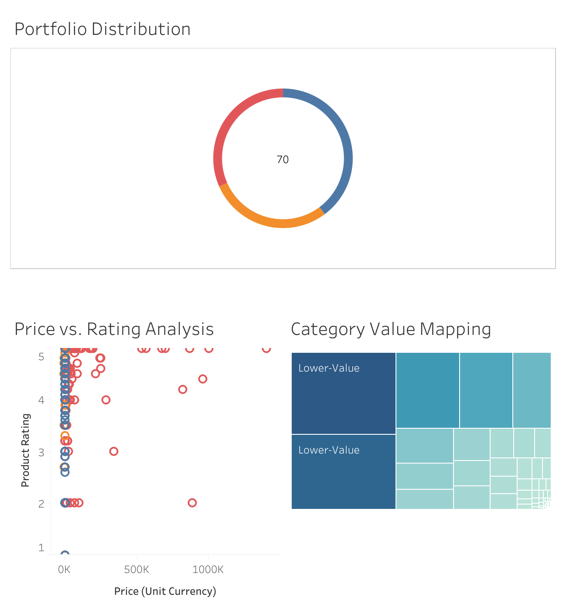

# 🇸🇪 IKEA Product Portfolio & Value Strategy Analysis

## 📌 Project Overview
This project focuses on analyzing the IKEA product dataset to evaluate pricing strategies, customer satisfaction (ratings), and the **"Value for Money" (VFM)** proposition. Using advanced SQL techniques, I transformed raw product data into a **Dynamic Flat Table** designed to power interactive BI dashboards.

---

## 🎯 Business Key Performance Indicators (KPIs)
The analysis is structured around four primary objectives:

* **Price Segmentation:** Categorizing products into Economy, Mid-Range, and Premium tiers.
* **Value for Money (VFM) Scoring:** Calculating the ratio between price and customer rating to identify "high-value" versus "overpriced" products.
* **Series Performance:** Extracting and analyzing iconic IKEA series (e.g., HEMNES, MALM, BILLY) to measure brand loyalty.
* **Omnichannel Availability:** Assessing the distribution of online-sellable products across categories.

---

## 🛠️ Technical Implementation (SQL)
The core of this project is a comprehensive SQL query that prepares the data for visualization. Key techniques used include:

* **Conditional Logic:** `CASE WHEN` statements for multi-tier segmentation.
* **String Manipulation:** `SPLIT_PART` to isolate product series from full names.
* **Error Handling:** Using `NULLIF` to prevent division-by-zero errors.
* **Data Modeling:** Creating a "Flat Table" architecture for seamless filter interaction.

### Key Query Snippet:
```sql
SELECT 
    product_name,
    main_category,
    SPLIT_PART(product_name, ' ', 1) AS series,
    price,
    product_rating,
    CASE 
        WHEN price < 500 THEN 'Economic'
        WHEN price BETWEEN 500 AND 2000 THEN 'Mid-Range'
        ELSE 'Premium'
    END AS price_segment,
    CASE 
        WHEN (price / NULLIF(product_rating, 0)) < 100 THEN 'High-Value'
        WHEN (price / NULLIF(product_rating, 0)) BETWEEN 100 AND 500 THEN 'Good-Value'
        ELSE 'Lower-Value'
    END AS price_rate
FROM ikea;


## 📊 Tableau Dashboard Insights
The final interactive dashboard provides a 360-degree view of the portfolio:
* **Portfolio Distribution:** A donut chart showing the split between Economic, Mid-Range, and Premium products.
* **Value Mapping:** A Treemap identifying which categories offer the best "Value for Money."
* **Efficiency Analysis:** A scatter plot highlighting products with high ratings but low prices (The "Sweet Spot").


